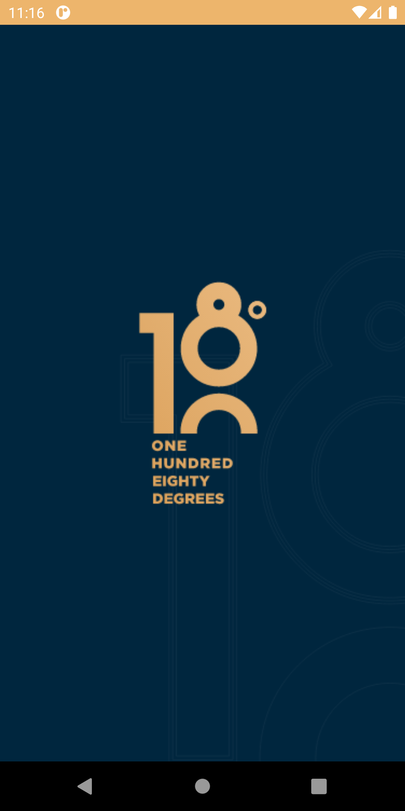
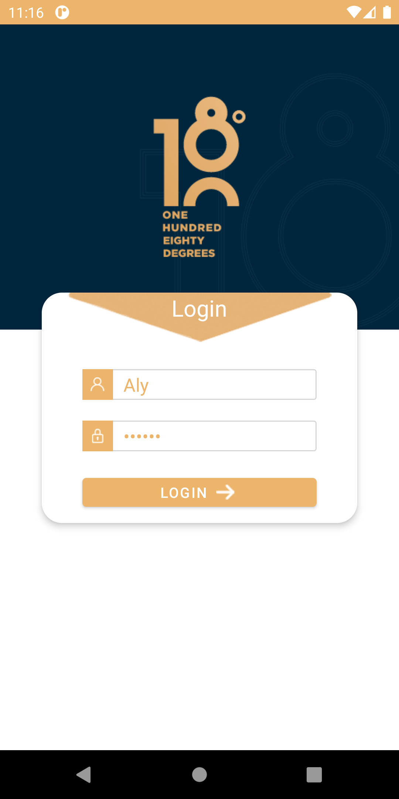
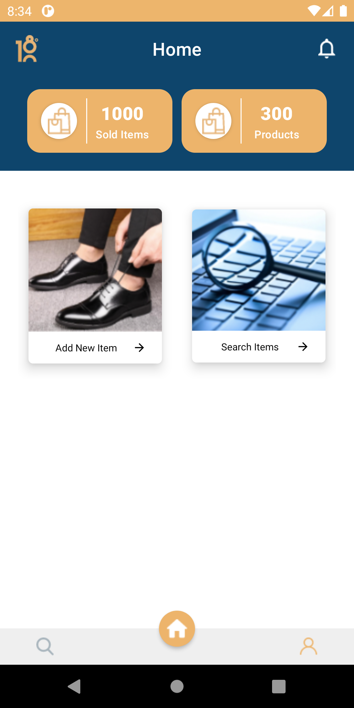

# 180 Degree
Simple android app design basedp on MVVN architecture pattern,material components and data/view binding.
Server Requests and Image Caching implemented using google Volley and Gson.

  
  

  
  

